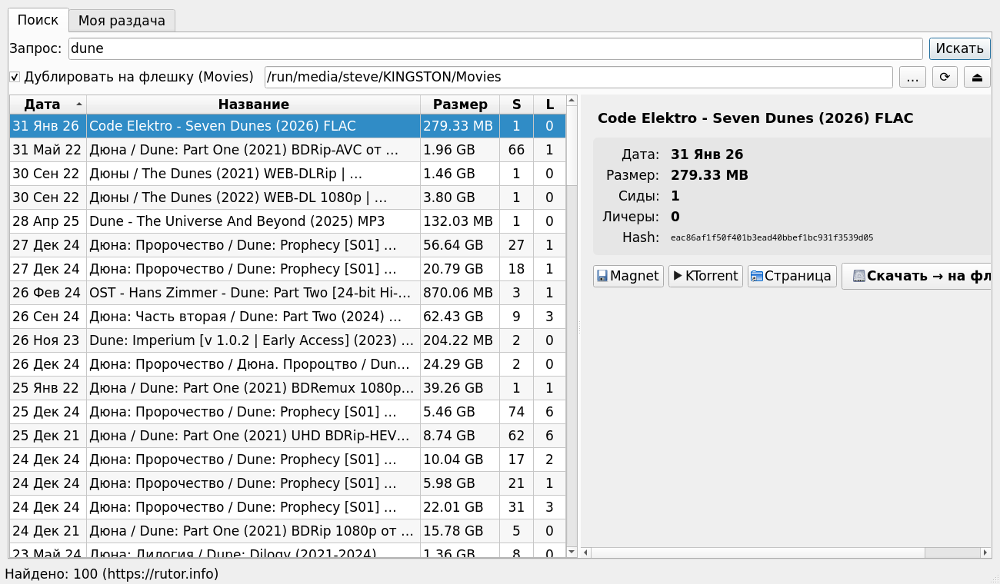

# ⚡ TorFlash

> Поиск торрентов на [rutor.info](https://rutor.info), скачивание и автоматическое копирование на USB-флешку с разбиением больших файлов под FAT32.

<p align="center">
  
</p>

Linux-десктоп приложение на PyQt5. Качает напрямую через `libtorrent-rasterbar`, парсит выдачу rutor по HTTP, складывает фильмы на флешку — без болтанки с «вставь флешку, открой ktorrent, дождись, скопируй вручную».

## Возможности

- 🔍 **Поиск** по rutor.info с автоматическим переключением между зеркалами (`rutor.info`, `rutor.is`, `rutor.org`)
- 🧲 **Magnet + .torrent**: качаем `.torrent` напрямую с rutor — метаданные мгновенно, без зависания на DHT
- 📚 **Постоянная библиотека**: всё скачанное лежит в `~/Storage`, раздаётся пока приложение запущено
- 🌱 **Сидинг** с автозагрузкой при старте — resume data, кэш .torrent файлов
- 💾 **Дублирование на флешку → `Movies`**: автоопределение USB-носителя в `/run/media/$USER/*`, папка создаётся сама
- ✂️ **Авторазбиение** файлов > 3.9 GiB на части (`movie.mkv.part000`, `.part001`…) — для FAT32
- ⏏ **Безопасное извлечение** флешки одной кнопкой (`udisksctl unmount` + `power-off`)
- 🎯 **Открыть в KTorrent** одним кликом — для торрентов с трудной раздачей
- 📊 Прогресс **в той же панели** (синий — скачивание, зелёный — копирование), без блокирующих модалок
- ⚙️ **Настройки**: автозапуск при входе в систему, скрытый старт, сворачивание в трей
- 🔄 **Самообновление** с GitHub Releases — кнопка в меню трея

## Скриншот

UI: список слева, детальная карточка справа, прогресс встроен в карточку.

## Установка

### Готовый бинарник (рекомендуется)

```bash
mkdir -p ~/Apps/TorFlash && cd ~/Apps/TorFlash
curl -L -o TorFlash https://github.com/steveast/torflash/releases/latest/download/TorFlash
chmod +x TorFlash
./TorFlash
```

Бинарник собран через PyInstaller, содержит Python + PyQt5 + libtorrent + requests. Зависит только от системных библиотек: Qt5, glibc, OpenSSL.

### Из исходников

Нужен Python 3.11+ и системные пакеты (Arch):

```bash
sudo pacman -S libtorrent-rasterbar python-pyqt5 python-requests
git clone https://github.com/steveast/torflash.git
cd torflash
python3 rutor_search.py
```

Для других дистрибутивов: `libtorrent-rasterbar` с Python-биндингами обычно идёт под именем `python3-libtorrent` (Debian/Ubuntu) или `python-libtorrent` (rpm).

## Самосборка бинарника

```bash
python3 -m venv --system-site-packages .build-venv
.build-venv/bin/pip install pyinstaller
.build-venv/bin/pyinstaller --onefile --windowed --name TorFlash \
    --add-data "torflash.svg:." rutor_search.py
# Готовый бинарник: dist/TorFlash
```

## Сетевые тонкости

Для нестандартных конфигураций (VPN, корпоративная сеть):

- UDP-трекеры и DHT-bootstrap могут блокироваться → приложение использует только HTTPS/HTTP трекеры
- Метаданные берутся **напрямую** из `.torrent` файла с rutor.info (не из DHT)
- uTP между пирами включён — это TCP-fallback BitTorrent over UDP, работает через NAT

## Использование

1. Введите запрос → Enter
2. Выберите результат в списке (детали справа)
3. Двойной клик ИЛИ кнопка «Скачать → на флешку»
4. Прогресс: синий бар = скачивание, зелёный = копирование
5. Готово — нажмите ⏏ для безопасного извлечения

Если флешки нет, снимите галочку «На флешку» — всё сложится в `~/Storage`.

## Архитектура

- `rutor_search.py` — единственный модуль (~1500 строк)
- `SearchWorker` — HTTP-парсинг rutor.info (regex, без BeautifulSoup)
- `SeedSession` — постоянная `libtorrent.session`, библиотека в `~/.local/share/TorFlash/library.json`, resume data, кэш `.torrent`
- `DownloadWorker` — добавляет в общую сессию, мониторит прогресс, по завершении оставляет в сидинге
- `CopyWorker` — потоковое копирование с разбиением на части по 3.9 GiB
- `UpdateChecker` / `UpdateDownloader` — GitHub Releases API + `os.execv` для перезапуска после обновления
- `SettingsDialog` — автозапуск (~/.config/autostart/TorFlash.desktop), скрытый старт, сворачивание в трей
- `MainWindow` — `QTabWidget` (поиск + библиотека), split-view внутри поиска

## Лицензия

MIT
