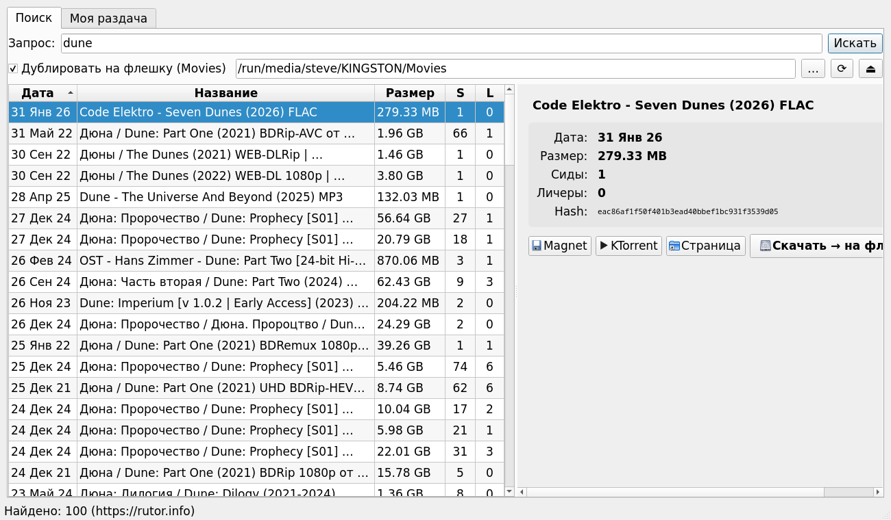

# ⚡ TorFlash

[](https://github.com/steveast/torflash/releases/latest)
[](https://github.com/steveast/torflash/actions)
[](LICENSE)
[](https://github.com/steveast/torflash/releases)

**[English](README.md)** · Русский

> Поиск торрентов на [rutor.info](https://rutor.info), скачивание и автоматическое копирование на USB-флешку с разбиением больших файлов под FAT32.

<p align="center">
  
</p>

Linux-десктоп приложение на PyQt5. Качает напрямую через `libtorrent-rasterbar`, парсит выдачу rutor по HTTP, складывает фильмы на флешку — без болтанки с «вставь флешку, открой ktorrent, дождись, скопируй вручную».

## Возможности

### Поиск
- 🔍 **Мульти-источник**: Rutor (зеркала), NoNaMe-Club, RuTracker (нужен аккаунт)
- 📂 **Фильтр категорий**: фильмы / сериалы / мультфильмы / игры / музыка / книги / софт / спорт и др.
- 🕘 **История запросов** с автодополнением
- 🖼 **Постер + скриншоты** в детальной панели (клик для увеличения)
- 🧲 **Magnet + .torrent**: качаем `.torrent` напрямую с источника — метаданные мгновенно
- 🔢 **Числовая сортировка** — сиды, личи и размер сортируются правильно
- 🌐 **i18n** — русский / английский, переключатель языка в настройках

### Библиотека и раздача
- 📚 **Постоянная библиотека**: всё лежит в `~/Storage` и раздаётся пока приложение запущено
- 🌱 **Восстановление сидинга** при старте — resume data, кэш `.torrent`
- ⏯ **Пауза / Возобновить / Перепроверить** для каждого торрента, очередь загрузок
- 🎞 **Mediainfo** в детальной панели (кодек, разрешение, дорожки, длительность) через `mediainfo` или `ffprobe`
- 📈 **Живой график скорости** — download/upload в реальном времени
- 📊 **Статистика за день** — скачано/отдано сегодня и за всё время (хранение 90 дней)

### Флешка
- 💾 **Автоопределение** USB в `/run/media/$USER/*`, копирование в `Movies/`
- ✂️ **Умная нарезка** для FAT32 (> 3.9 GiB):
  - **MKV** через `mkvmerge --split size:NM` — каждая часть проигрывается отдельно
  - Остальные форматы — byte-split с расширением в конце (`name.part000.mkv`)
- 📁 **Вкладка «Флешка»**: содержимое, удаление файлов, открытие в файл-менеджере
- ⏏ **Безопасное извлечение** (`udisksctl unmount` + `power-off`) с пошаговым статусом (sync → unmount → power-off); если занято — показывается процесс
- 🔁 **Pending flash copy** переживает перезапуск — флаг в `library.json`, авто-копирование когда торрент готов и флешка доступна

### Приложение и управление
- 🎯 **Открыть в KTorrent** в один клик
- 📊 Прогресс в той же панели (синий — скачивание, зелёный — копирование), без блокирующих модалок
- 🎨 **Тема**: системная / светлая / тёмная
- 🚦 **Лимиты скорости** (↓/↑ КБ/с) в настройках
- 🌍 **Глобальный прокси** (SOCKS5 / HTTP) — используется для всех запросов (поиск, постеры, обновления), настраивается в секции «Сеть»
- ⚙️ **Вкладка настроек**: автозапуск, скрытый старт, трей, RuTracker-логин
- 🔄 **Самообновление** с GitHub Releases — вручную и автоматически раз в сутки
- 🔧 **CLI** для скриптов: `torflash_cli.py search QUERY | list | download URL | remove HASH`

## Скриншот

UI: список слева, детальная карточка справа, прогресс встроен в карточку.

## Установка

### Готовый бинарник (рекомендуется)

```bash
mkdir -p ~/Apps/TorFlash && cd ~/Apps/TorFlash
curl -L -o TorFlash https://github.com/steveast/torflash/releases/latest/download/TorFlash
chmod +x TorFlash
./TorFlash
```

Бинарник собран через PyInstaller, содержит Python + PyQt5 + libtorrent + requests. Зависит только от системных библиотек: Qt5, glibc, OpenSSL.

### Из исходников

Нужен Python 3.11+ и системные пакеты (Arch):

```bash
sudo pacman -S libtorrent-rasterbar python-pyqt5 python-requests
git clone https://github.com/steveast/torflash.git
cd torflash
python3 src/rutor_search.py
```

Для других дистрибутивов: `libtorrent-rasterbar` с Python-биндингами обычно идёт под именем `python3-libtorrent` (Debian/Ubuntu) или `python-libtorrent` (rpm).

## Самосборка бинарника

```bash
python3 -m venv --system-site-packages .build-venv
.build-venv/bin/pip install pyinstaller
.build-venv/bin/pyinstaller --clean --noconfirm TorFlash.spec
# Готовый бинарник: dist/TorFlash
```

## Сетевые тонкости

Для нестандартных конфигураций (VPN, корпоративная сеть):

- UDP-трекеры и DHT-bootstrap могут блокироваться → приложение использует только HTTPS/HTTP трекеры
- Метаданные берутся **напрямую** из `.torrent` файла с rutor.info (не из DHT)
- uTP между пирами включён — это TCP-fallback BitTorrent over UDP, работает через NAT

## Использование

1. Введите запрос → Enter
2. Выберите результат в списке (детали справа)
3. Двойной клик ИЛИ кнопка «Скачать → на флешку»
4. Прогресс: синий бар = скачивание, зелёный = копирование
5. Готово — нажмите ⏏ для безопасного извлечения

Если флешки нет, снимите галочку «На флешку» — всё сложится в `~/Storage`.

## Архитектура

- `src/rutor_search.py` — основной модуль
- `SearchWorker` — HTTP-парсинг rutor.info (regex, без BeautifulSoup)
- `SeedSession` — постоянная `libtorrent.session`, библиотека в `~/.local/share/TorFlash/library.json`, resume data, кэш `.torrent`
- `DownloadWorker` — добавляет в общую сессию, мониторит прогресс, по завершении оставляет в сидинге
- `CopyWorker` — потоковое копирование с разбиением на части по 3.9 GiB
- `UpdateChecker` / `UpdateDownloader` — GitHub Releases API + `os.execv` для перезапуска после обновления
- `providers/` — подключаемые провайдеры поиска: Rutor, NNM, RuTracker
- `MainWindow` — `QTabWidget` (поиск + библиотека + флешка + настройки), split-view внутри вкладок

## Лицензия

MIT
